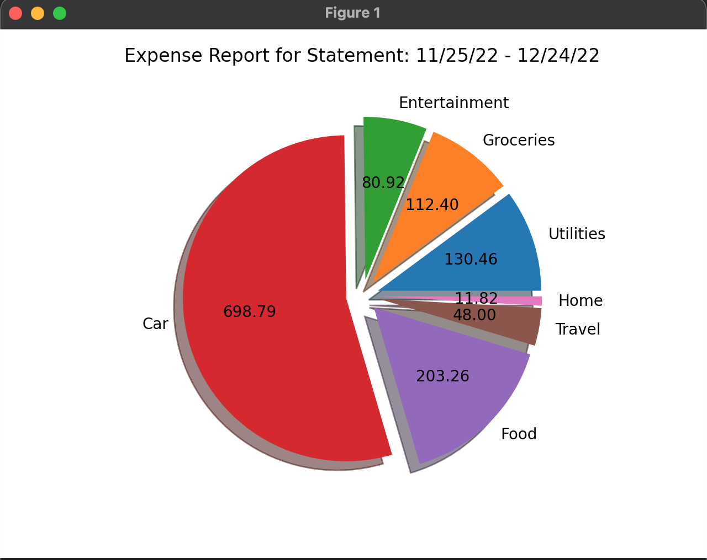

# Expense Report Generator

This app will parse your Credit Card statement from txt format and categorize the expenses. Add 
your credit card statement in the stmt directory of this project and run the app following the 
steps below to generate your expense report.

## Requirements

For building and running the application you need:

- [Python3](https://www.python.org/downloads/)

```shell
pip3 install -r requirements.txt
```
OR
```shell
pip install -r requirements.txt
```

## Running the application locally

You can run the main.py program to get started. This file has the __main__ method.

```shell
python3 ./src/main.py
```
OR
```shell
python ./src/main.py
```

## Sample report generation


